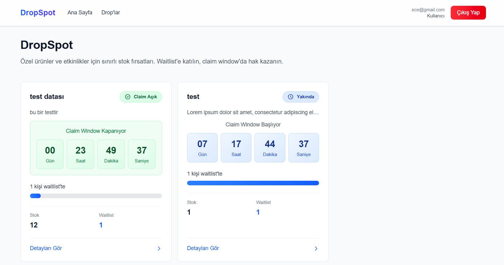
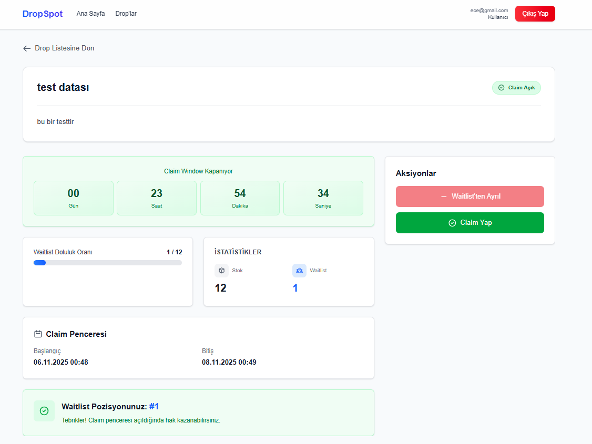
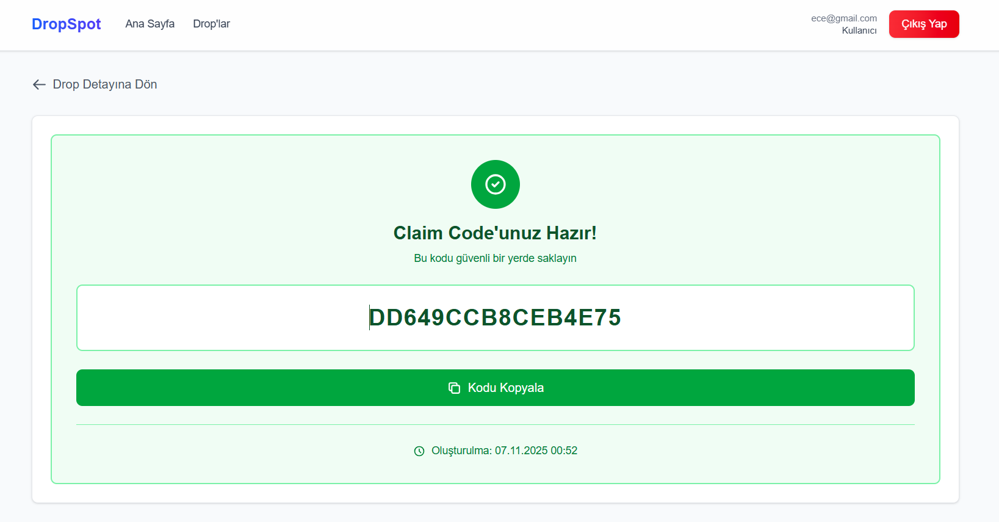
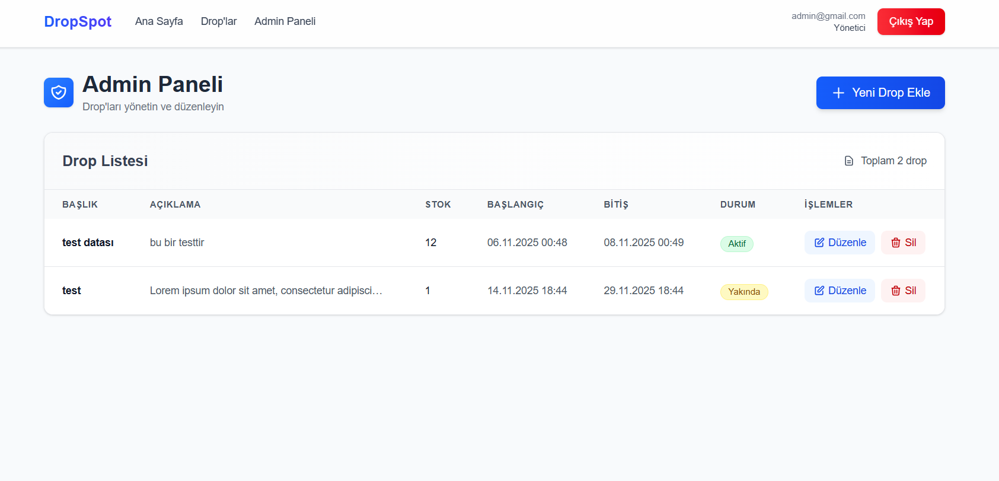

# DropSpot – Sınırlı Stok ve Bekleme Listesi Platformu

## 📋 Proje Başlangıç Zamanı

**Başlangıç Tarihi:** 4 Kasım 2025, 09:00 (202511040900)

---

## 🎯 Proje Özeti

DropSpot, özel ürünlerin veya etkinliklerin sınırlı stokla yayımlandığı bir platformdur. Kullanıcılar bu platformda drop'lara kayıt olabilir, bekleme listesine katılabilir ve "claim window" zamanı geldiğinde sırayla hak kazanırlar. Sistem, adil bir sıralama mekanizması (priority score) kullanarak kullanıcıların drop'lara erişimini yönetir.

### Temel Özellikler

- ✅ Kullanıcı kayıt ve giriş sistemi (JWT tabanlı)
- ✅ Aktif drop listesi görüntüleme
- ✅ Waitlist'e katılma/ayrılma
- ✅ Claim window sırasında claim code alma
- ✅ Admin CRUD modülü (drop yönetimi)
- ✅ AI destekli açıklama önerisi (OpenAI entegrasyonu)
- ✅ Priority score tabanlı adil sıralama sistemi
- ✅ Idempotent API işlemleri
- ✅ Transaction tabanlı veri bütünlüğü

---

## 🚀 Kurulum Adımları

### Backend Kurulumu

1. **Bağımlılıkları yükleyin:**
```bash
cd backend
npm install
```

2. **Ortam değişkenlerini ayarlayın:**
```bash
cp sample.env .env
```

`.env` dosyasını düzenleyin:
```env
DATABASE_URL="file:./dev.db"
OPENAI_API_KEY="your-openai-api-key-here"
```

3. **Backend'i başlatın:**
```bash
npm run dev
```

> **Not:** `npm run dev` komutu otomatik olarak veritabanı migration'larını çalıştırır (`predev` script'i sayesinde). İlk çalıştırmada veritabanı oluşturulur ve gerekli tablolar hazırlanır. Migration ismi sorulduğunda Enter'a basabilir veya bir isim girebilirsiniz.

Backend `http://localhost:5000` adresinde çalışacaktır.

**Opsiyonel - Seed değerini kontrol etmek için:**
```bash
npm run seed
```

### Frontend Kurulumu

1. **Bağımlılıkları yükleyin:**
```bash
cd frontend
npm install
```

2. **Frontend'i başlatın:**
```bash
npm run dev
```

Frontend `http://localhost:3000` adresinde çalışacaktır.

> **Not:** API URL'i (`http://localhost:5000`) store dosyalarında hardcoded olarak tanımlanmıştır. Backend'in aynı portta çalıştığından emin olun.

### Test Çalıştırma

**Backend Testleri:**
```bash
cd backend
npm test
```

**Frontend Testleri:**
```bash
cd frontend
npm test
```

### Production Build

**Backend:**
```bash
cd backend
npm run build
npm start
```

**Frontend:**
```bash
cd frontend
npm run build
npm start
```

---

## 👤 Admin Bilgisi

### Varsayılan Admin Kullanıcısı

Proje ilk çalıştırıldığında otomatik olarak oluşturulan admin kullanıcısı:

- **Email:** `admin@gmail.com`
- **Şifre:** `Admin*123`
- **Rol:** `ADMIN`

Bu bilgilerle admin paneline (`/admin`) giriş yapabilir ve drop yönetimi yapabilirsiniz.

> **Not:** Production ortamında bu varsayılan admin kullanıcısını değiştirmeniz veya kaldırmanız önerilir.

### Admin Yetkileri

- ✅ Drop oluşturma, güncelleme ve silme
- ✅ AI destekli açıklama önerisi alma
- ✅ Tüm drop'ları görüntüleme
- ❌ Waitlist'e katılamaz (admin kullanıcıları waitlist'e katılamaz)

---

## 🏗️ Mimari Açıklama

### Teknoloji Stack

**Backend:**
- **Runtime:** Node.js
- **Framework:** Express.js 5.1.0
- **Dil:** TypeScript
- **Veritabanı:** SQLite (Prisma ORM)
- **Kimlik Doğrulama:** JWT (jsonwebtoken)
- **Şifreleme:** bcryptjs
- **AI Entegrasyonu:** OpenAI API (gpt-3.5-turbo)

**Frontend:**
- **Framework:** Next.js 16.0.1 (App Router)
- **UI Kütüphanesi:** React 19.2.0
- **Dil:** TypeScript
- **Stil:** Tailwind CSS v4
- **State Yönetimi:** Zustand 5.0.8
- **HTTP İstemcisi:** Axios

### Mimari Yapı

```
root/
├── backend/
│   ├── src/
│   │   ├── config/          # Seed ve konfigürasyon
│   │   ├── controllers/     # İş mantığı katmanı
│   │   ├── middleware/      # Auth middleware
│   │   ├── routes/          # API route tanımları
│   │   ├── utils/           # Yardımcı fonksiyonlar
│   │   └── server.ts        # Express server
│   ├── prisma/
│   │   ├── schema.prisma    # Veritabanı şeması
│   │   └── migrations/      # Veritabanı migrasyonları
│   ├── tests/
│   │   ├── integration/     # Integration testleri
│   │   └── unit/            # Unit testleri
│   └── scripts/             # Seed hesaplama scripti
│
└── frontend/
    ├── app/                 # Next.js App Router sayfaları
    │   ├── admin/           # Admin panel
    │   ├── auth/             # Giriş/kayıt sayfaları
    │   └── drops/           # Drop listesi ve detay sayfaları
    ├── components/          # React bileşenleri
    ├── store/               # Zustand state yönetimi
    └── tests/               # Frontend testleri
```

### Veri Akışı

1. **Kullanıcı Kayıt/Giriş:** Email ve şifre ile kayıt → JWT token üretimi
2. **Drop Listeleme:** Aktif drop'lar pagination ile listelenir
3. **Waitlist'e Katılma:** Priority score hesaplanır → Transaction ile kayıt → Pozisyon güncellenir
4. **Claim İşlemi:** Claim window kontrolü → Pozisyon kontrolü → Transaction ile claim code üretimi
5. **Admin CRUD:** Admin yetkisi kontrolü → Drop CRUD işlemleri

---

## 📊 Veri Modeli

### User Model
```prisma
model User {
  id           String   @id @default(uuid())
  email        String   @unique
  passwordHash String
  role         Role     @default(USER)  // ADMIN veya USER
  createdAt    DateTime @default(now())
  updatedAt    DateTime?
  waitlistEntries WaitlistEntry[]
  claimCodes    ClaimCode[]
}
```

### Drop Model
```prisma
model Drop {
  id              String   @id @default(uuid())
  title           String
  description     String?
  stock           Int      @default(0)
  claimWindowStart DateTime
  claimWindowEnd   DateTime
  createdAt       DateTime @default(now())
  updatedAt       DateTime?
  waitlistEntries WaitlistEntry[]
  claimCodes      ClaimCode[]
}
```

### WaitlistEntry Model
```prisma
model WaitlistEntry {
  id            String   @id @default(uuid())
  userId        String
  dropId        String
  position      Int                    // Sıralama pozisyonu
  priorityScore Int                    // Öncelik skoru
  createdAt     DateTime @default(now())
  user          User     @relation(...)
  drop          Drop     @relation(...)

  @@unique([userId, dropId])           // Bir kullanıcı bir drop için tek entry
  @@index([dropId, position])
  @@index([dropId, priorityScore])
}
```

### ClaimCode Model
```prisma
model ClaimCode {
  id        String   @id @default(uuid())
  code      String   @unique              // Benzersiz claim code
  userId    String
  dropId    String
  used      Boolean  @default(false)
  createdAt DateTime @default(now())
  usedAt    DateTime?
  user      User     @relation(...)
  drop      Drop     @relation(...)

  @@unique([userId, dropId])             // Bir kullanıcı bir drop için tek claim code
  @@index([dropId])
  @@index([userId])
  @@index([code])
}
```

---

## 🔌 API Endpoint Listesi

### Authentication Endpoints

| Method | Endpoint | Açıklama
|--------|----------|----------
| POST | `/auth/signup` | Kullanıcı kayıt
| POST | `/auth/login` | Kullanıcı giriş

**Request Body (signup/login):**
```json
{
  "email": "user@example.com",
  "password": "password123"
}
```

**Response (login):**
```json
{
  "message": "Giriş başarılı.",
  "token": "eyJhbGciOiJIUzI1NiIsInR5cCI6IkpXVCJ9...",
  "user": {
    "id": "uuid",
    "email": "user@example.com",
    "role": "USER"
  }
}
```

### Drops Endpoints

| Method | Endpoint | Açıklama | Auth Gerekli |
|--------|----------|----------|--------------|
| GET | `/drops` | Aktif drop listesi (pagination) | ✅ |
| GET | `/drops/:id` | Drop detayı | ✅ |
| GET | `/drops/:id/waitlist-status` | Kullanıcının waitlist durumu | ✅ |
| POST | `/drops/:id/join` | Waitlist'e katıl | ✅ |
| POST | `/drops/:id/leave` | Waitlist'ten ayrıl | ✅ |
| POST | `/drops/:id/claim` | Claim code al | ✅ |

**Query Parameters (GET /drops):**
- `page` (optional): Sayfa numarası (default: 1)
- `limit` (optional): Sayfa başına kayıt (default: 10)

**Örnek İstekler:**
```bash
# İlk sayfa (varsayılan)
GET /drops

# İkinci sayfa, sayfa başına 20 kayıt
GET /drops?page=2&limit=20

# Üçüncü sayfa, sayfa başına 9 kayıt (3x3 grid için)
GET /drops?page=3&limit=9
```

**Response (GET /drops):**
```json
{
  "message": "Aktif drop'lar başarıyla getirildi.",
  "drops": [
    {
      "id": "uuid",
      "title": "Özel Ürün Drop",
      "description": "Açıklama metni",
      "stock": 100,
      "claimWindowStart": "2025-11-10T10:00:00Z",
      "claimWindowEnd": "2025-11-10T12:00:00Z",
      "_count": {
        "waitlistEntries": 45
      }
    }
  ],
  "pagination": {
    "page": 1,
    "limit": 10,
    "total": 25,
    "totalPages": 3,
    "hasNextPage": true,
    "hasPrevPage": false
  }
}
```

**Pagination Özellikleri:**
- ✅ Sayfa numarası ve limit parametreleri ile esnek pagination
- ✅ Toplam kayıt sayısı ve toplam sayfa bilgisi
- ✅ Sonraki/önceki sayfa kontrolü (`hasNextPage`, `hasPrevPage`)
- ✅ Varsayılan değerler: `page=1`, `limit=10`
- ✅ Frontend'te pagination component'i ile kullanıma hazır

### Admin Endpoints

| Method | Endpoint | Açıklama | Auth Gerekli | Admin Gerekli |
|--------|----------|----------|--------------|---------------|
| POST | `/admin/drops` | Yeni drop oluştur | ✅ | ✅ |
| PUT | `/admin/drops/:id` | Drop güncelle | ✅ | ✅ |
| DELETE | `/admin/drops/:id` | Drop sil | ✅ | ✅ |
| POST | `/admin/ai/suggest-description` | AI ile açıklama öner | ✅ | ✅ |

**Request Body (POST /admin/drops):**
```json
{
  "title": "Özel Ürün Drop",
  "description": "Açıklama metni",
  "stock": 100,
  "claimWindowStart": "2025-11-10T10:00:00Z",
  "claimWindowEnd": "2025-11-10T12:00:00Z"
}
```

**Request Body (POST /admin/ai/suggest-description):**
```json
{
  "title": "Özel Ürün Drop",
  "description": "Mevcut açıklama (opsiyonel)"
}
```

---

## 🛠️ CRUD Modülü Açıklaması

Admin CRUD modülü, drop'ların tam yönetimini sağlar. Tüm admin işlemleri için `ADMIN` rolü gereklidir.

### Özellikler

1. **Drop Oluşturma (POST /admin/drops)**
   - Yeni drop ekleme
   - Claim window tarihleri ve stock miktarı belirleme
   - Validasyon: claimWindowStart < claimWindowEnd

2. **Drop Güncelleme (PUT /admin/drops/:id)**
   - Mevcut drop bilgilerini güncelleme
   - Tüm alanlar opsiyonel (partial update)
   - Claim window başlamışsa güncelleme kısıtlamaları

3. **Drop Silme (DELETE /admin/drops/:id)**
   - Drop ve ilişkili kayıtları silme (cascade delete)
   - Waitlist entry'leri ve claim code'lar otomatik silinir

4. **AI Destekli Açıklama Önerisi**
   - OpenAI GPT-3.5-turbo kullanarak açıklama önerisi
   - Mevcut açıklamayı geliştirme veya yeni açıklama üretme
   - Maksimum 500 karakter sınırı

### Yetkilendirme

- Tüm admin endpoint'leri `authenticate` middleware'i ile korunur
- `requireAdmin` middleware'i ile `ADMIN` rolü kontrol edilir
- Admin bilgileri için yukarıdaki "Admin Bilgisi" bölümüne bakın

---

## 🔒 Idempotency Yaklaşımı ve Transaction Yapısı

### Idempotency Prensibi

Sistem, aynı işlemin birden fazla kez yapılması durumunda tutarlı sonuçlar üretir. Bu özellikle network hataları, retry mekanizmaları ve race condition'lar için kritiktir.

### 1. Join Waitlist Idempotency

```typescript
// Transaction içinde mevcut entry kontrolü
const existingEntry = await findWaitlistEntry(userId, dropId, tx);

if (existingEntry) {
    return {
        entry: existingEntry,
        message: 'Zaten waitlist\'tesiniz.'
    };
}
```

**Özellikler:**
- `@@unique([userId, dropId])` constraint ile veritabanı seviyesinde koruma
- Transaction içinde kontrol → Race condition önleme
- Mevcut entry varsa aynı entry döndürülür (idempotent)

### 2. Claim Idempotency

```typescript
// Mevcut claim code kontrolü (transaction içinde)
const existingClaimCode = await tx.claimCode.findFirst({
    where: { userId, dropId }
});

if (existingClaimCode) {
    return {
        claimCode: existingClaimCode,
        message: 'Zaten claim code\'unuz mevcut.'
    };
}
```

**Özellikler:**
- `@@unique([userId, dropId])` constraint ile tek claim code garantisi
- Transaction içinde kontrol → Aynı kullanıcı aynı anda birden fazla claim yapamaz
- Mevcut code varsa aynı code döndürülür (idempotent)

### Transaction Yapısı

Tüm kritik işlemler Prisma `$transaction` API'si ile korunur:

```typescript
const result = await prisma.$transaction(async (tx) => {
    // 1. Drop kontrolü
    const drop = await findDropById(dropId, tx);
    
    // 2. Mevcut kayıt kontrolü (idempotency)
    const existingEntry = await findWaitlistEntry(userId, dropId, tx);
    
    // 3. Priority score hesaplama
    const priorityScore = await calculatePriorityScore(...);
    
    // 4. Yeni kayıt oluşturma
    const newEntry = await tx.waitlistEntry.create({...});
    
    // 5. Pozisyonları güncelleme
    await recalculateWaitlistPositions(dropId, tx);
    
    return result;
});
```

**Transaction Avantajları:**
- **ACID Garantisi:** Tüm işlemler atomik olarak çalışır
- **Race Condition Önleme:** Aynı anda gelen istekler sırayla işlenir
- **Veri Bütünlüğü:** Hata durumunda rollback
- **Consistency:** Pozisyon güncellemeleri tutarlı kalır

### Claim İşleminde Sıralı Kontrol

Claim işleminde, kullanıcının sırasının geldiğinden emin olmak için ek kontrol yapılır:

```typescript
// Mevcut claim sayısı
const claimedCount = await tx.claimCode.count({ where: { dropId } });

// Pozisyon kontrolü: pozisyon = claimedCount + 1 olmalı
if (waitlistEntry.position !== claimedCount + 1) {
    throw new Error('NOT_YOUR_TURN');
}
```

Bu yaklaşım, waitlist sırasına göre claim işleminin yapılmasını garanti eder.

---

## 📸 Ekran Görüntüleri

### 1. Drop Listesi Sayfası



**Açıklama:** Drop listesi sayfası, kullanıcıların tüm aktif drop'ları görüntüleyebildiği ana sayfadır. Sayfa, modern ve kullanıcı dostu bir grid layout ile tasarlanmıştır.

**Görünen Özellikler:**
- **Grid Layout:** Drop'lar 3 sütunlu responsive grid yapısında gösterilir (mobilde tek sütun, tablette 2 sütun, masaüstünde 3 sütun)
- **Drop Kartları:** Her drop kartında:
  - Drop başlığı ve kısa açıklaması
  - Durum badge'i (Upcoming/Active/Ended) - renk kodlu
  - Countdown timer (claim window başlangıç/bitiş zamanı)
  - Progress bar (waitlist doluluk oranı)
  - Stock ve waitlist sayısı istatistikleri
  - "Detayları Gör" butonu
- **Pagination:** Sayfanın altında sayfa numaraları ve navigasyon butonları
- **Header:** "DropSpot" başlığı ve açıklama metni

**Teknik Detaylar:**
- Real-time countdown timer ile dinamik zaman gösterimi
- Pagination ile performanslı veri yükleme
- Responsive tasarım (mobile-first yaklaşım)
- Loading state'leri ve error handling

---

### 2. Drop Detay Sayfası



**Açıklama:** Drop detay sayfası, kullanıcıların seçtikleri drop hakkında detaylı bilgi alabildiği ve waitlist işlemlerini gerçekleştirebildiği sayfadır.

**Görünen Özellikler:**
- **Sol Kolon (Ana Bilgiler):**
  - Drop başlığı ve açıklaması
  - Status countdown (claim window durumuna göre)
  - Progress bar (waitlist doluluk oranı)
  - Drop istatistikleri (stock, waitlist sayısı)
  - Claim window bilgileri (başlangıç ve bitiş tarihleri)
  - Waitlist durumu (kullanıcının pozisyonu)
- **Sağ Kolon (Aksiyonlar):**
  - Waitlist'e katılma/ayrılma butonları
  - Claim butonu (claim window açıkken)
  - Durum mesajları (pozisyon bilgisi, sıra durumu)
- **Geri Dön Butonu:** Drop listesine geri dönüş

**Kullanıcı Senaryoları:**
- **Waitlist'te değilse:** "Join Waitlist" butonu görünür
- **Waitlist'teyse:** Pozisyon bilgisi ve "Leave Waitlist" butonu görünür
- **Claim window açıksa:** Claim butonu aktif olur
- **Pozisyon stok içindeyse:** Claim işlemi yapılabilir
- **Sıra bekleniyorsa:** "Sıranız gelmedi" mesajı gösterilir

**Teknik Detaylar:**
- Real-time pozisyon takibi
- Durum bazlı dinamik UI değişiklikleri
- Toast bildirimleri ile kullanıcı geri bildirimi
- Transaction-safe waitlist işlemleri

---

### 3. Claim Code Sayfası



**Açıklama:** Claim code sayfası, kullanıcının claim window sırasında hak kazandığı claim code'unu görüntüleyebildiği sayfadır.

**Görünen Özellikler:**
- **Claim Code Display:**
  - Büyük ve okunabilir claim code gösterimi
  - Kopyalama butonu (clipboard'a kopyalama)
  - Code oluşturulma tarihi
  - Kullanım durumu (used/unused)
- **Geri Dön Butonu:** Drop detay sayfasına geri dönüş
- **Bilgilendirme Mesajları:** Claim code'un nasıl kullanılacağı hakkında bilgi

**Kullanıcı Deneyimi:**
- Claim code güvenli bir şekilde gösterilir
- Tek tıkla kopyalama özelliği
- Toast bildirimi ile kopyalama onayı
- Responsive tasarım ile mobil uyumluluk

**Teknik Detaylar:**
- Clipboard API ile güvenli kopyalama
- Claim code benzersizlik garantisi
- Idempotent claim işlemi (aynı code tekrar alınamaz)

---

### 4. Admin Paneli



**Açıklama:** Admin paneli, yöneticilerin drop'ları yönetebildiği, oluşturup düzenleyebildiği ve silebildiği yönetim arayüzüdür.

**Görünen Özellikler:**
- **Drop Tablosu:**
  - Tüm drop'ların listesi (aktif ve pasif)
  - Drop başlığı, açıklama, stock bilgisi
  - Claim window tarihleri
  - Waitlist ve claim code sayıları
  - İşlem butonları (Düzenle, Sil)
- **Yeni Drop Oluşturma:**
  - Modal form ile drop oluşturma
  - Form alanları: başlık, açıklama, stock, claim window tarihleri
  - AI ile açıklama önerisi butonu
  - Form validasyonu
- **Drop Düzenleme:**
  - Mevcut drop bilgilerini güncelleme
  - AI ile açıklama geliştirme
- **Drop Silme:**
  - Onay modal'ı ile güvenli silme
  - Cascade delete (ilişkili kayıtlar otomatik silinir)

**Admin Özellikleri:**
- **AI Entegrasyonu:** OpenAI GPT-3.5-turbo ile açıklama önerisi
- **Form Validasyonu:** Tarih kontrolü, stock kontrolü
- **Hata Yönetimi:** Kullanıcı dostu hata mesajları
- **Toast Bildirimleri:** İşlem sonuç bildirimleri

**Teknik Detaylar:**
- Role-based access control (sadece ADMIN erişebilir)
- CRUD işlemleri için RESTful API entegrasyonu
- Modal-based UI pattern
- Responsive tablo tasarımı
- Real-time veri güncelleme

---

## 🎨 Teknik Tercihler ve Kişisel Katkılar

### Backend Teknik Tercihleri

1. **TypeScript Kullanımı**
   - Tip güvenliği ve geliştirici deneyimi
   - Interface'ler ile API kontratları
   - Compile-time hata yakalama

2. **Prisma ORM**
   - Type-safe veritabanı sorguları
   - Migration yönetimi
   - İlişkisel veri yönetimi

3. **Modüler Mimari**
   - Controller → Route → Middleware ayrımı
   - Utility fonksiyonlarının ayrılması
   - Tek sorumluluk prensibi

4. **Error Handling**
   - Merkezi hata yönetimi (`apiErrorHandler`)
   - Idempotent handler desteği
   - Anlamlı hata mesajları

5. **Transaction Yönetimi**
   - Kritik işlemlerde transaction kullanımı
   - Race condition önleme
   - Veri bütünlüğü garantisi

### Frontend Teknik Tercihleri

1. **Next.js App Router**
   - Modern routing yapısı
   - Server Components desteği
   - Built-in optimizasyonlar

2. **Zustand State Yönetimi**
   - Minimal boilerplate
   - Type-safe store'lar
   - Performanslı re-render kontrolü

3. **Component-Based Architecture**
   - Yeniden kullanılabilir bileşenler
   - Separation of concerns
   - Props interface'leri ile tip güvenliği

4. **Tailwind CSS**
   - Utility-first CSS yaklaşımı
   - Responsive tasarım
   - Tutarlı tasarım sistemi

5. **Axios ile HTTP İstemcisi**
   - Interceptor'lar ile token yönetimi
   - Merkezi hata yönetimi
   - Request/Response transformasyonu

### Kişisel Katkılar ve İnovasyonlar

1. **Priority Score Sistemi**
   - Deterministik seed tabanlı katsayılar
   - Adil sıralama algoritması
   - Spam koruması (rapid actions)

2. **Idempotent API Tasarımı**
   - Transaction içinde idempotency kontrolü
   - Hata durumunda mevcut kayıt döndürme
   - Retry-safe işlemler

3. **AI Entegrasyonu**
   - OpenAI API ile açıklama önerisi
   - Mevcut açıklamayı geliştirme
   - Kullanıcı dostu admin paneli

4. **Kapsamlı Hata Yönetimi**
   - Durum bazlı hata mesajları
   - Idempotent handler pattern
   - Kullanıcı dostu mesajlar

5. **Test Kapsamı**
   - Unit testler (priority score)
   - Integration testler (join waitlist)
   - Component testleri (frontend)

---

## 🌱 Seed Üretim Yöntemi ve Proje İçindeki Kullanımı

### Seed Üretim Adımları

Seed değeri, projenin benzersiz kimliğini temsil eden deterministik bir değerdir. Tüm ortamlarda (dev/staging/prod) aynı seed üretilir.

**Adımlar:**

1. **Remote URL:** `https://github.com/bssenoz/DropSpott.git`
2. **İlk Commit Epoch:** `1762355373` (git log ile alınan)
3. **Proje Başlangıç Zamanı:** `202511040900` (YYYYMMDDHHmm formatında)

**Hesaplama:**
```typescript
const raw = `${remote}|${epoch}|${start}`;
const seed = crypto.createHash('sha256')
    .update(raw)
    .digest('hex')
    .substring(0, 12);
```

**Örnek Seed:** `a1b2c3d4e5f6` (12 hex karakter)

### Katsayı Üretimi

Seed'den A, B, C katsayıları türetilir:

```typescript
const A = 7 + (parseInt(seed.substring(0, 2), 16) % 5);  // 7-11 arası
const B = 13 + (parseInt(seed.substring(2, 4), 16) % 7); // 13-19 arası
const C = 3 + (parseInt(seed.substring(4, 6), 16) % 3);  // 3-5 arası
```

**Örnek Katsayılar:**
- A = 9 (signup_latency_ms modülü için)
- B = 16 (account_age_days modülü için)
- C = 4 (rapid_actions modülü için)

### Priority Score Formülü

```typescript
priority_score = base 
    + (signupLatencyMs % COEFFICIENT_A)      // Erken katılanlar avantajlı
    + (accountAgeDays % COEFFICIENT_B)       // Eski hesaplar avantajlı
    - (rapidActions % COEFFICIENT_C)         // Spam koruması
```

**Açıklama:**
- `base = 1000`: Temel skor
- `signupLatencyMs`: Drop oluşturulma zamanından waitlist'e katılma zamanına kadar geçen süre (ms)
- `accountAgeDays`: Hesap yaşı (gün cinsinden)
- `rapidActions`: Son 5 dakikadaki join + claim sayısı (spam koruması)

**Kullanım:**
- Seed ve katsayılar `src/config/seed.ts` dosyasında export edilir
- `src/utils/priorityScore.ts` dosyasında import edilip kullanılır
- Tüm ortamlarda aynı seed ve katsayılar kullanılır (deterministik)

**Seed Kontrolü:**
```bash
cd backend
npm run seed
```

Bu komut seed değerini ve katsayıları konsola yazdırır.

---

## 🤖 Bonus: AI Entegrasyonu

### OpenAI Entegrasyonu

Admin panelinde, drop oluştururken veya düzenlerken AI ile açıklama önerisi alabilirsiniz.

**Endpoint:** `POST /admin/ai/suggest-description`

**Özellikler:**
- GPT-3.5-turbo modeli kullanımı
- Türkçe açıklama üretimi
- Maksimum 500 karakter sınırı
- Mevcut açıklamayı geliştirme desteği
- Hata yönetimi (API key, rate limit)

**Kullanım Senaryosu:**
1. Admin, drop oluşturma formunda "AI ile Öner" butonuna tıklar
2. Sistem, başlığı OpenAI API'sine gönderir
3. AI, çekici ve profesyonel bir açıklama üretir
4. Açıklama otomatik olarak form alanına doldurulur

**Teknik Detaylar:**
- System prompt: "500 karakteri geçmeyecek türkçe açıklama"
- User prompt: Başlık ve opsiyonel mevcut açıklama
- Temperature: 0.7 (yaratıcılık dengesi)
- Max tokens: 200

**Güvenlik:**
- API key environment variable'da saklanır
- Admin yetkisi kontrolü
- Rate limit ve hata yönetimi

---

## 🧪 Test ve Kalite

### Backend Testleri

**Unit Testler:**
- `priorityScore.test.ts`: Priority score hesaplama testi
  - Seed katsayılarının doğru kullanımı
  - Farklı senaryolar (erken katılım, eski hesap, spam)

**Integration Testler:**
- `joinWaitlist.test.ts`: Waitlist'e katılma testi
  - Idempotency kontrolü
  - Transaction rollback senaryoları
  - Hata durumları

**Test Çalıştırma:**
```bash
cd backend
npm test
```

### Frontend Testleri

**Component Testleri:**
- `CountdownTimer.test.tsx`: Countdown timer bileşeni
- `Modal.test.tsx`: Modal bileşeni

**Test Çalıştırma:**
```bash
cd frontend
npm test
```

### Test Kapsamı

- ✅ Idempotency senaryoları
- ✅ Edge case'ler (claim window kapalı, stok tükendi, vb.)
- ✅ Transaction rollback durumları
- ✅ Priority score hesaplama doğruluğu
- ✅ Component render testleri

---

## 🔐 Güvenlik Notları

- JWT token'lar HTTP-only cookie'lerde saklanabilir (production için önerilir)
- Şifreler bcrypt ile hash'lenir (salt rounds: 10)
- Admin endpoint'leri role-based access control ile korunur
- SQL injection koruması (Prisma ORM)
- CORS yapılandırması (sadece frontend origin'i)

---

## 📚 Ek Kaynaklar

- [Prisma Dokümantasyonu](https://www.prisma.io/docs)
- [Next.js Dokümantasyonu](https://nextjs.org/docs)
- [Express.js Dokümantasyonu](https://expressjs.com/)
- [OpenAI API Dokümantasyonu](https://platform.openai.com/docs)

---

**Son Güncelleme:** 6 Kasım 2025

